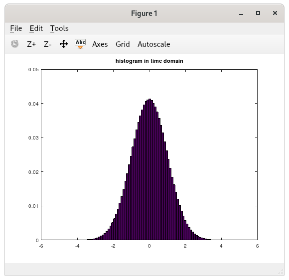
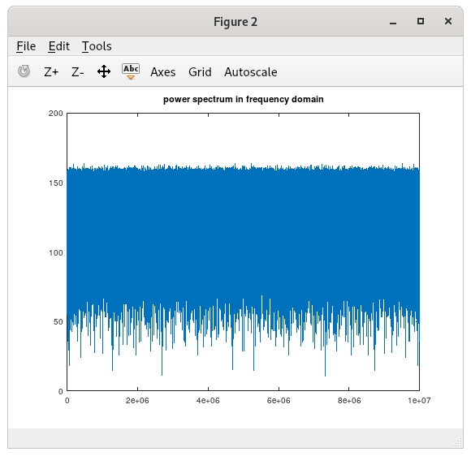

# gaussian
A simple demo example to reproduce gaussian distribution using box-muller method

Steps to reproduce :

1. g++ -o gaussian gaussian.cpp
2. octave gaussian.m

**Time domain**

**Frequency domain**

